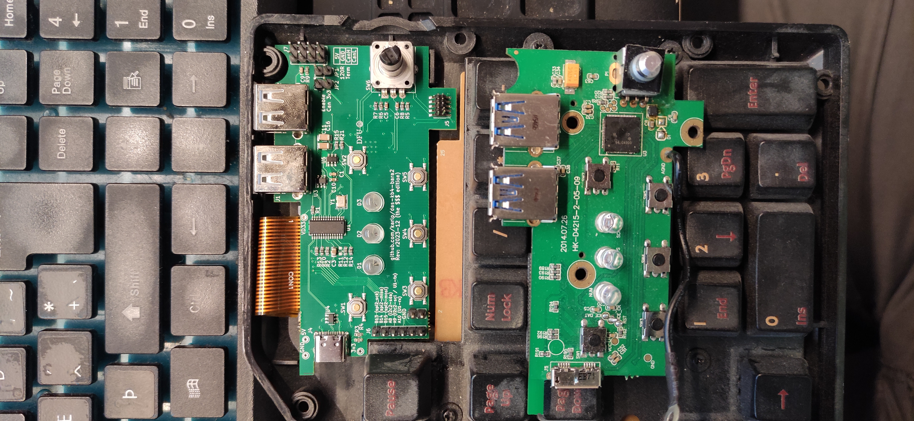

## What's it like?

## Don't use this one
I was badly misled that jlc could do double sided assembly for "no" extra price, so I didn't take any real care with it.

It wouldn't realllly be hard to make this a single sided assembly board, but, damnit, I didn't have time to go and do it all again,
so I just decided to bite the bullet and get rev1 back.  This ended up costing ~160 for 5 boards, plus shipping and taxes. (5 pcbs is ~$10 and 5 boards worth of parts s ~$28)

If it all works out, and I'm still crazy, I may make a rev2 of this, that simplifies this better, and uses single sided assembly to make it massively cheaper to have assembled.  I don't _really_ enjoy stencilling and soldering at home...

This also means I get 5 boards, completely assembled with alllll optional bits.  (It won't fit in the keyboard like that, but... whatever, we can work with that later)

## Actual errors/fixes required
there are couple of NPTH holes on the original board that I missed were important for mounting the button/led frame.
Likewise, a couple of landing spaces for that frame that now have parts in them.
Not huge, but definitely need to be done to move it forwards as far as a "replacement" goes.

Also, the ribbon cable mount needs to move left maybe 5mm, to avoid bending it unnecessarily.

Finally, the USB-C connector shoudl move about 3.5mm down to fit cables better in the keyboard.
